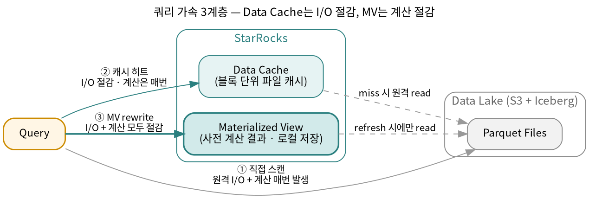
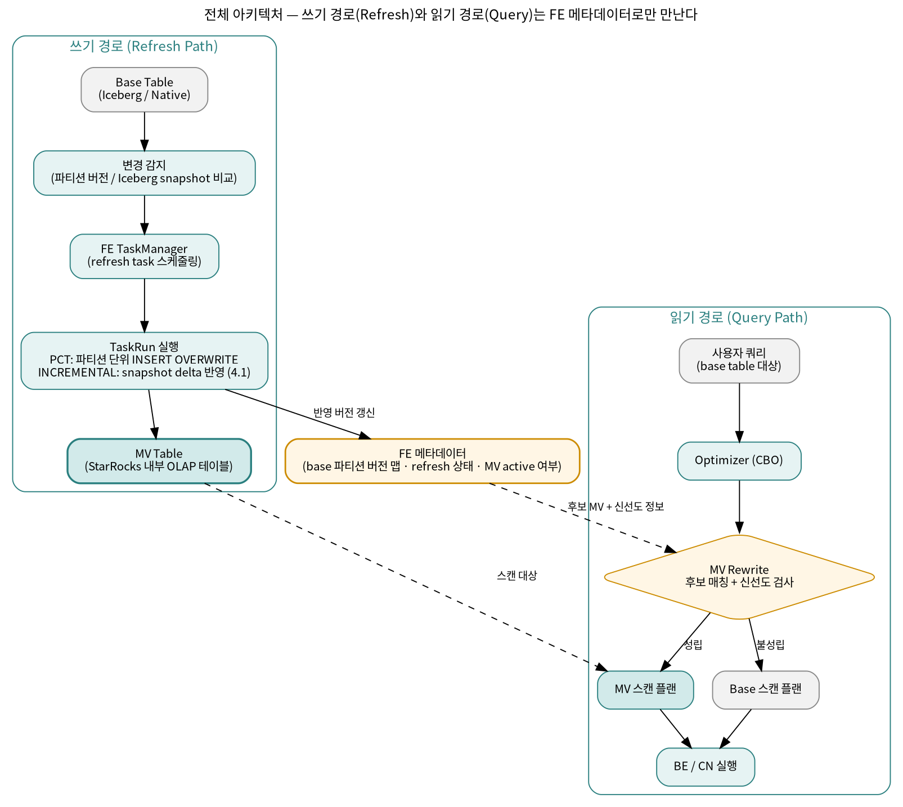
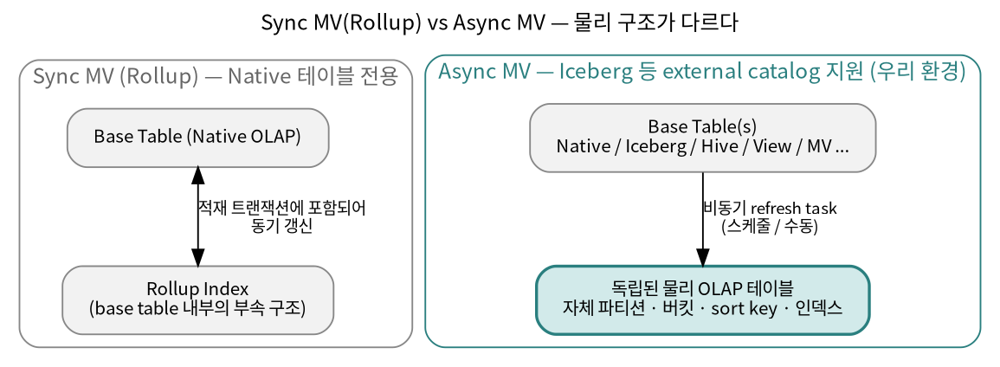
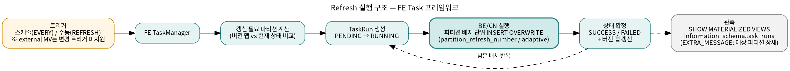
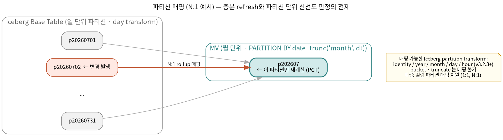
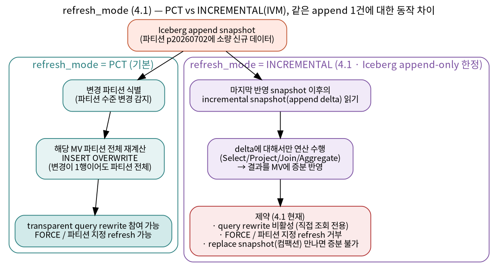
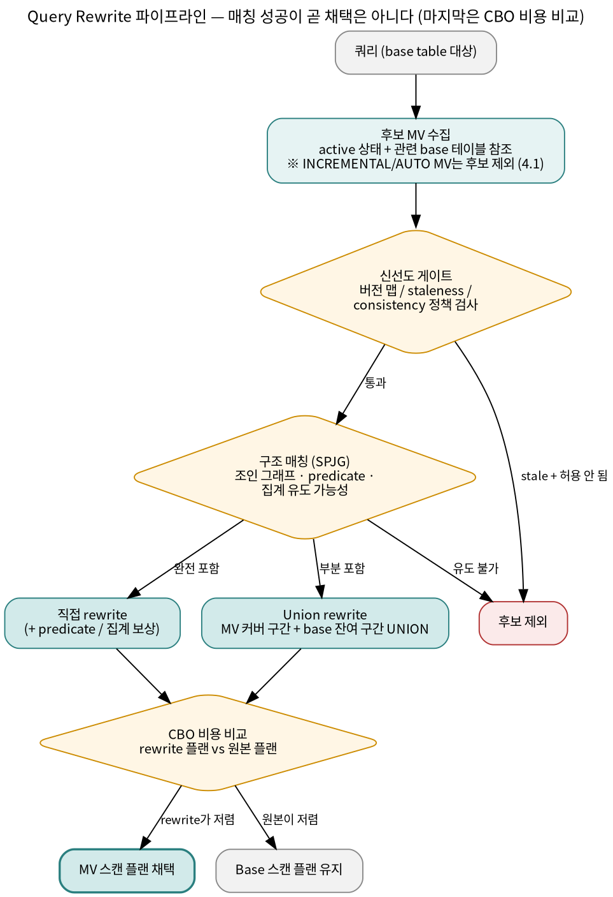
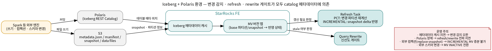

# StarRocks Materialized View 엔지니어링 심화 가이드 (v4.1 기준)

> **대상 독자**: Data Platform 운영자, StarRocks 기반 쿼리 엔진을 다루는 엔지니어
> **환경 전제**: StarRocks 4.1을 Iceberg Table + Polaris(REST Catalog) 기반 Data Platform의 쿼리 엔진으로 사용
> **버전 기준**: StarRocks 4.1 (2026-04 릴리스) 공식 문서 및 릴리스 노트 기준. 하위 버전에서 도입된 기능은 도입 버전을 병기했다.
> **운영 참고**: 4.1.0 컨테이너 이미지에는 BE 기동 불안정 이슈가 있어 컨테이너 환경은 4.1.1 이상을 사용해야 하며, 4.1에서 tablet 분할/분배 관련 데이터 레이아웃이 변경되어 다운그레이드는 4.0.6 이상으로만 가능하다.

---

## 목차

1. [왜 MV인가 — 문제 정의](#1-왜-mv인가--문제-정의)
2. [전체 아키텍처 개관](#2-전체-아키텍처-개관)
3. [Sync MV vs Async MV](#3-sync-mv-vs-async-mv)
4. [Async MV의 물리적 실체 — "MV는 OLAP 테이블이다"](#4-async-mv의-물리적-실체--mv는-olap-테이블이다)
5. [Refresh 메커니즘 — PCT와 IVM](#5-refresh-메커니즘--pct와-ivm)
6. [Optimizer와 Query Rewrite](#6-optimizer와-query-rewrite)
7. [Iceberg + Polaris 환경 특화 사항](#7-iceberg--polaris-환경-특화-사항)
8. [운영 관점의 원리와 체크리스트](#8-운영-관점의-원리와-체크리스트)
9. [직접 검증 계획](#9-직접-검증-계획)
10. [참고 자료](#10-참고-자료)

---

## 1. 왜 MV인가 — 문제 정의

레이크하우스(Iceberg) 데이터를 쿼리 엔진에서 직접 조회할 때 비용은 세 군데에서 발생한다.

1. **메타데이터 해석 비용**: 쿼리 시점마다 Iceberg snapshot → manifest → data file 목록을 해석해야 한다.
2. **원격 I/O 비용**: 오브젝트 스토리지(S3 등)에서 Parquet 파일을 읽는 네트워크 비용. 지연 변동(jitter)도 크다.
3. **반복 계산 비용**: 대시보드·리포트처럼 같은 조인/집계가 반복 실행되면, 매번 같은 계산을 다시 한다.

StarRocks는 이 세 비용을 각각 다른 계층에서 줄인다.



핵심 구분: **Data Cache는 I/O를 절감하고, MV는 계산을 절감한다.** Data Cache가 켜져 있어도 조인·집계 계산은 매 쿼리마다 수행된다. 반복되는 계산 패턴이 있다면 MV가 그 위 계층의 가속 수단이다. 공식 문서도 "Data Cache로도 지연·동시성 요구를 못 맞추는 경우, 재사용 가능한 집계/조인 패턴이 있는 경우"를 MV 사용 시나리오로 제시한다. 참고로 4.1은 캐시 관측성(클러스터/테이블/파티션/쿼리 수준 캐시 지표의 audit log·profile 통합)이 강화되어, "Data Cache로 충분한가 vs MV가 필요한가"를 데이터로 판단하기가 쉬워졌다.

이 방향(레이크 원천 위에 증분 갱신되는 사전 계산 레이어)은 업계 공통 흐름이기도 하다. Databricks는 Lakeflow 기반 MV의 증분 refresh를, Snowflake는 Dynamic Tables를, Redshift는 Iceberg 테이블 위 MV 증분/자동 refresh와 자동 query rewrite를 밀고 있다. 차이는 **증분 refresh의 정교함, transparent rewrite의 범위, 오픈 포맷 소스 지원**의 조합에 있으며, StarRocks는 4.1에서 Iceberg 대상 진짜 증분 계산(IVM)까지 추가하면서 이 조합을 가장 넓게 갖춘 엔진 중 하나가 됐다 (5.4절).

---

## 2. 전체 아키텍처 개관

MV는 두 개의 독립적인 경로로 이해하면 된다. **쓰기 경로(refresh path)** 와 **읽기 경로(query path)**. 두 경로는 FE(Frontend)의 MV 메타데이터를 통해서만 만난다.



기억할 포인트 세 가지.

- **MV의 데이터는 StarRocks 내부 테이블에 물리적으로 저장된다.** 원천이 Iceberg여도 MV 데이터 자체는 StarRocks가 관리하는 스토리지에 있다 (shared-data 아키텍처에서는 오브젝트 스토리지 + 로컬 캐시 계층). 그래서 네이티브 테이블의 가속 수단(인덱스, 정렬, 버케팅)을 그대로 쓸 수 있다.
- **FE가 "base 테이블의 어떤 파티션/snapshot이 어디까지 MV에 반영됐는가"를 추적한다.** 이 버전 맵이 증분 refresh와 rewrite 신선도 판정의 공통 기반이다.
- **rewrite는 옵티마이저 내부에서 일어난다.** 사용자는 base table을 조회하고, 플랜만 바뀐다. 애플리케이션·BI 쿼리 수정이 필요 없다는 것이 이 구조의 존재 이유다.

4.1에서 쓰기 경로에 중요한 분기가 생겼다. 기존의 **PCT(파티션 단위 재계산)** 에 더해, Iceberg append-only 테이블에 한해 **INCREMENTAL(snapshot delta 기반 증분 계산, IVM)** 모드가 추가됐다. 상세는 5.4절.

---

## 3. Sync MV vs Async MV

StarRocks에는 이름이 같지만 구현이 전혀 다른 두 종류의 MV가 있다.



| 구분 | Sync MV (Rollup) | Async MV |
|---|---|---|
| 물리 구조 | base table에 종속된 rollup index | 완전히 독립된 OLAP 테이블 |
| 갱신 시점 | 데이터 적재와 **동기** (적재 트랜잭션에 포함) | 스케줄/수동에 의한 **비동기** task |
| 소스 테이블 | default catalog의 네이티브 테이블 1개만 | 다중 테이블, external catalog, view, 다른 MV 가능 |
| 쿼리 형태 | 단일 테이블 + 제한된 집계 함수 | 조인, 복잡한 집계, CTE(v3.1.6+) 등 대부분의 SELECT |
| 신선도 | 항상 최신 (동기 갱신) | 최종적 일관성 (refresh 주기에 의존) |
| Rewrite | 자동 라우팅 (rollup 선택) | SPJG 기반 transparent rewrite (v2.5+) |
| shared-data 지원 | v3.4.0+ | 지원 |

**우리 환경에서 Sync MV는 선택지가 아니다.** Sync MV는 default catalog 네이티브 테이블의 부속 구조라서 Iceberg external catalog 테이블 위에는 만들 수 없다. 이 문서의 나머지는 전부 **Async MV** 에 관한 것이다. 다만 개념 구분은 알아둘 가치가 있다 — "StarRocks MV"를 논할 때 두 종류(동기 rollup vs 비동기 독립 테이블)를 구분하는 것 자체가 이해도의 신호가 된다.

---

## 4. Async MV의 물리적 실체 — "MV는 OLAP 테이블이다"

Async MV를 이해하는 가장 좋은 프레임은 "**정의 쿼리(defining query)가 붙어 있고, refresh가 자동화된 일반 OLAP 테이블**"이다. CREATE MATERIALIZED VIEW 구문이 CREATE TABLE과 거의 같은 물리 설계 옵션을 받는 이유다.

```sql
CREATE MATERIALIZED VIEW dw.sales_daily_mv
PARTITION BY date_trunc('day', order_dt)        -- MV 자체의 파티셔닝
DISTRIBUTED BY HASH(store_id)                   -- 버케팅 (생략 시 random bucketing)
ORDER BY (store_id, order_dt)                   -- sort key
REFRESH ASYNC EVERY (INTERVAL 1 HOUR)           -- 4.1부터 SCHEDULE 키워드도 동의어로 사용 가능
PROPERTIES (
    "partition_refresh_number" = "2",           -- refresh 배치 크기
    "refresh_mode" = "pct",                     -- 4.1: pct(기본) | incremental
    "session.enable_spill" = "true"             -- refresh task에 적용할 세션 변수
)
AS
SELECT order_dt, store_id, sum(amount) AS amt, count(*) AS cnt
FROM iceberg_cat.sales.orders                   -- Iceberg 원천
GROUP BY order_dt, store_id;
```

물리 설계에서 챙길 것들:

- **파티셔닝**: base 테이블 파티션과의 매핑이 PCT 증분 refresh의 전제다 (5.3절). 시간 컬럼에 `date_trunc()`를 써서 단위를 바꿀 수 있고(일 → 월 등), 다중 컬럼 파티션 MV를 Iceberg/Hive 테이블 파티션과 직접 정렬시키는 것도 지원된다.
- **버케팅**: `DISTRIBUTED BY HASH(...)` 또는 생략(random bucketing). 단, random bucketing MV는 colocation group에 넣을 수 없다. 조인 가속용 colocate MV를 만들려면 해시 버케팅이 필수.
- **Sort key / 인덱스**: `ORDER BY`로 정렬 키를, `bloom_filter_columns` 속성으로 블룸 필터 인덱스를 걸 수 있다 (`ALTER MATERIALIZED VIEW`로 사후 변경 가능). 레이크의 Parquet에는 없는, 네이티브 테이블의 스캔 가속이 그대로 적용되는 지점이다.
- **session.\* 속성**: refresh task 실행 시 적용할 세션 변수를 MV 속성으로 고정한다 (`session.enable_spill`, `session.insert_timeout` 등). refresh 워크로드를 서빙 워크로드와 다르게 튜닝하는 공식 통로다.
- **tablet 관리 (4.1)**: shared-data 모드의 tablet 자동 분할·대용량 tablet(~30GB) 지원은 MV 테이블에도 해당된다. 대형 MV의 tablet 수 설계 부담이 4.1에서 상당 부분 시스템으로 넘어갔다.

> **설계 관점 한 줄 요약**: MV 설계 = "이 집계 결과를 저장할 최적의 OLAP 테이블 설계" + "원천과의 파티션 매핑 설계" + (4.1부터) "**refresh_mode 선택**". 셋 중 무엇을 놓치느냐에 따라 각각 서빙 성능, 증분 refresh, refresh 비용이 무너진다.

---

## 5. Refresh 메커니즘 — PCT와 IVM

### 5.1 Refresh 전략

CREATE 시점의 `REFRESH` 절로 결정한다.

| 전략 | 구문 | 트리거 |
|---|---|---|
| 자동 (변경 트리거) | `REFRESH ASYNC` | base 테이블 데이터 변경 시마다 — **네이티브 base 한정** |
| 스케줄 | `REFRESH ASYNC [START (...)] EVERY (INTERVAL ...)` | 주기적. 변경이 없으면 실제 refresh는 스킵 |
| 수동 | `REFRESH MANUAL` | `REFRESH MATERIALIZED VIEW` 실행 시에만 |

- **external catalog MV의 중요한 제약**: Iceberg 등 external base의 데이터 변경을 StarRocks가 실시간 이벤트로 받을 수 없으므로, **변경 트리거 자동 refresh는 지원되지 않는다. 고정 주기(EVERY) 또는 수동 refresh만 가능**하다. 우리 환경의 신선도 하한은 결국 "refresh 주기"로 결정된다는 뜻이다.
- 4.1부터 `SCHEDULE` 키워드를 `ASYNC`의 동의어로 쓸 수 있다 (의미 명확화 목적의 문법 추가).
- 생성 직후 즉시 refresh 여부는 `IMMEDIATE`(기본) / `DEFERRED`로 제어한다.
- 수동 refresh는 파티션 범위 지정(`PARTITION START ... END ...`), 강제 재계산(`FORCE`), 동기/비동기 호출(`WITH SYNC | ASYNC MODE`), 그리고 `CANCEL REFRESH MATERIALIZED VIEW`에 의한 취소를 지원한다.
- **주의**: external catalog 기반 MV를 파티션 지정 없이 수동 REFRESH하면 전체 파티션이 대상이 될 수 있다. 대형 MV라면 파티션 범위를 명시하는 습관이 안전하다.

### 5.2 실행 구조: TaskManager와 TaskRun

refresh는 FE의 Task 프레임워크 위에서 실행된다. MV 하나의 refresh는 하나의 Task로 등록되고, 트리거될 때마다 TaskRun이 생성되어 큐잉·실행된다.



동작 특성:

- **파티션 배치 분할**: 파티션이 많은 대형 MV는 한 번에 다 갱신하지 않고 `partition_refresh_number` 개수만큼 배치로 나눠 refresh한다 (v2.5+). 리소스·데이터량 기반으로 배치 크기를 자동 결정하는 adaptive partition refresh도 지원된다.
- **관측**: `SHOW MATERIALIZED VIEWS`로 마지막 refresh 시각·상태·에러를, `information_schema.task_runs`로 개별 TaskRun의 상태(PENDING/RUNNING/SUCCESS/FAILED)와 상세를 확인한다. `EXTRA_MESSAGE`에는 갱신 예정 MV 파티션 목록, base 테이블 → 파티션 매핑, 다음 증분 refresh 시작 경계 등이 기록된다. 운영 대시보드의 1차 데이터 소스다. v3.3부터는 여러 배치로 쪼개진 refresh의 전체 task_run 상태를 `SHOW MATERIALIZED VIEWS`가 함께 추적한다.
- **INSERT OVERWRITE 의미론 (PCT 기준)**: refresh 단위는 "MV 파티션의 원자적 교체"다. 부분 반영 상태가 노출되지 않고, 실패한 TaskRun은 해당 배치 파티션만 롤백된다.

### 5.3 변경 감지와 파티션 수준 refresh (PCT)

PCT(Partition Change Tracking)의 원리는 단순하다: **FE가 "base 파티션별 버전"을 기억하고, 현재 상태와 비교해 달라진 파티션에 대응하는 MV 파티션만 다시 계산한다.**

변경 감지 소스가 무엇이냐에 따라 구현이 갈린다.

| 원천 | 변경 감지 방법 | 지원 버전 |
|---|---|---|
| Native OLAP 테이블 | 파티션 visible version 비교 (FE 내부 메타) | 기본 |
| Hive catalog | HMS/Glue 파티션 메타 폴링 (메타데이터 캐시 refresh 필요) | 기본 |
| **Iceberg catalog** | **snapshot 메타데이터 비교로 변경 파티션 식별** | **v3.1.4+** |
| Paimon catalog | 파티션 수준 감지 | v3.2.1+ |
| JDBC catalog | MySQL range 파티션 테이블 한정 | v3.1.4+ |
| Hudi catalog | 파티션 수준 감지 불가 → 항상 full refresh | — |

> **문서상 주의 표기**: 현행 공식 문서는 Iceberg의 파티션 수준 변경 감지에 대해 "현재 Iceberg V1 테이블만 지원"이라고 명시하고 있다. 우리처럼 V2(및 V3) 테이블을 쓰는 환경에서는 파티션 수준 감지가 기대대로 동작하는지 반드시 실측해야 한다 (9장 실험 3). V2에서 감지가 안 되면 PCT의 이점(부분 refresh + 파티션 단위 신선도 판정)이 축소된다.

파티션 수준 감지가 되면 두 가지가 좋아진다: (1) 변경된 파티션만 refresh → 리소스 절약, (2) rewrite 시 "이 파티션은 stale하다"를 파티션 단위로 판정 → 신선도 게이팅이 세밀해진다 (6.4절).

**파티션 매핑 규칙** — PCT가 성립하려면 MV 파티션 키가 base 파티션 키에 포함되는 매핑이 정의 가능해야 한다.



- **1:1 매핑**: base와 동일 단위. 가장 단순하고 증분 효율이 좋다.
- **N:1 매핑**: `date_trunc()`로 상위 단위로 롤업 (일→월 등). base의 일 파티션 하나가 변경되면 대응하는 MV 월 파티션이 재계산된다.
- **다중 컬럼 파티션 매핑**: 다중 컬럼 파티션 MV를 Iceberg/Hive 테이블 파티션과 직접 정렬 (1:1, N:1).
- **다중 fact 테이블 매핑** (v3.3+): 같은 시간 단위로 조인/유니온되는 복수 fact 테이블과의 파티션 매핑. 어느 쪽이 변경돼도 해당 MV 파티션이 갱신된다.
- **Iceberg partition transform** (v3.2.3+): `identity`, `year`, `month`, `day`, `hour` transform 지원. `bucket`, `truncate` transform은 매핑 대상이 아니므로, **Iceberg 테이블 설계 시점부터 MV 계획을 고려해 시간 기반 transform을 선택**해야 한다.

refresh 범위·저장량 제어 속성들도 매핑 위에서 동작한다: `excluded_trigger_tables`(특정 base 테이블 변경은 트리거로 무시), `auto_refresh_partitions_limit`(최신 N개 파티션만 자동 refresh), `partition_ttl` / `partition_retention_condition`(오래된 MV 파티션 자동 삭제 — 6.4절 `force_mv`와 연계).

### 5.4 refresh_mode와 IVM — 4.1의 핵심 변화

PCT의 구조적 한계는 **재계산 단위가 "파티션"이라는 것**이다. 일 파티션에 10행이 추가돼도 그 파티션 전체를 다시 계산한다. 변경량 대비 재계산량의 증폭이 큰 워크로드(소량 append가 잦은 스트리밍성 적재)에서는 refresh 비용이 과도해진다.

4.1은 이 문제에 대해 **IVM(Incremental View Maintenance) 프레임워크**를 도입하고, MV 속성 `refresh_mode`로 노출했다.



| | `refresh_mode = pct` (기본) | `refresh_mode = incremental` (4.1) |
|---|---|---|
| 재계산 단위 | 변경 파티션 **전체** | 마지막 반영 snapshot 이후의 **append delta만** |
| 적용 대상 | 모든 지원 catalog | **Iceberg append-only 테이블 한정** |
| 연산 지원 | 정의 쿼리 전반 | Select / Project / Join / Aggregate (Phase 1 범위) |
| delete/update | 파티션 재계산으로 자연 흡수 | 미지원 — 증분 불가 데이터를 만나면 실패 |
| 컴팩션(replace snapshot) | 영향 없음 (파티션 재계산) | **증분 refresh 불가** — append 외 snapshot이 끼면 깨진다 |
| query rewrite | 참여 | **4.1 현재 비활성** (MV 직접 조회 전용) |
| FORCE / 파티션 지정 refresh | 가능 | **거부됨** |

동작 원리와 의미론:

- **INCREMENTAL은 "증분만 수행함"을 보장하는 모드다.** 정의 쿼리가 증분 계산을 지원하지 않거나 증분 불가능한 데이터(delete, replace snapshot)를 만나면, 조용히 full refresh로 폴백하지 않고 **생성 또는 refresh가 실패한다**. 예측 가능성을 위한 의도된 설계다 — "증분인 줄 알았는데 매번 full이었다"는 비용 사고를 방지한다.
- 미지정 시 기본값은 FE 파라미터 `default_mv_refresh_mode`(기본 `pct`)를 따른다.
- 릴리스 노트에는 `AUTO` 모드(증분/전체를 시스템이 선택)도 언급되며, `INCREMENTAL`과 동일하게 4.1 현재 query rewrite 대상에서 제외되고 FORCE/파티션 지정 refresh가 거부된다.
- IVM의 이론적 뿌리는 관계 대수 기반의 delta 계산(변경분에 연산을 적용해 결과 변경분을 유도)이다. StarRocks 구현은 상태(state)가 필요한 연산(집계 등)에서 별도 상태 테이블 대신 결과 테이블 자체를 상태로 재사용하는 접근을 취한다. Iceberg의 snapshot 경계가 delta의 자연스러운 단위가 되므로, "Iceberg append-only"라는 제약은 우연이 아니라 설계의 출발점이다.

**선택 기준 (4.1 현재):**

- **transparent rewrite가 목적이면 PCT.** 사용자 쿼리 수정 없이 가속하는 우리 플랫폼의 기본 시나리오는 여전히 PCT다.
- **INCREMENTAL은 "MV를 직접 조회하는 파생 테이블" 용도로.** 신선도가 중요하고 refresh 비용이 민감한 append-only 스트림 집계(예: 로그/이벤트 시간별 집계 서빙 테이블)에 적합하다. rewrite 미참여는 향후 릴리스에서 바뀔 수 있는 제약이므로 릴리스 노트를 추적할 것.
- **INCREMENTAL 채택 전 컴팩션 정책 합의가 선행돼야 한다.** Spark 등 외부 엔진의 주기적 컴팩션(rewrite_data_files)은 replace snapshot을 만들어 증분을 깨뜨린다. 대상 테이블의 컴팩션 주기·방식과 MV refresh의 조율이 플랫폼 차원에서 필요하다 (7장, 8장).

### 5.5 리소스 제어와 실패 처리

refresh는 본질적으로 "무거운 배치 연산"이다. 서빙 쿼리와 같은 클러스터에서 돌기 때문에 격리가 운영의 핵심 이슈가 된다.

- **메모리**: 대형 집계/조인 refresh가 메모리를 소진하면 실패한다. 완화 수단은 (1) 파티션 MV + 배치 분할로 작업 단위 축소, (2) `session.enable_spill = true`로 중간 결과 디스크 스필 (v3.1+), (3) 해당되는 경우 INCREMENTAL로 계산량 자체를 축소.
- **리소스 격리**: MV 속성으로 refresh task가 사용할 resource group을 지정해 서빙 워크로드와 분리할 수 있다. 멀티테넌시 관점에서는 "이 MV의 refresh 비용을 어느 테넌트/그룹에 귀속시킬 것인가"의 기술적 앵커가 된다 (8장).
- **실패 진단 루틴**: `SHOW MATERIALIZED VIEWS`의 에러 메시지 → `information_schema.task_runs`의 해당 TaskRun `EXTRA_MESSAGE` → (필요시) FE 로그. 실패 원인의 대부분은 메모리 초과, 타임아웃(`session.insert_timeout`), 원천 메타데이터 접근 실패, 그리고 4.1부터는 INCREMENTAL 모드의 증분 불가 데이터 감지가 추가된다.

---

## 6. Optimizer와 Query Rewrite

### 6.1 이론 배경

StarRocks의 transparent rewrite는 **SPJG(Select-Project-Join-Group-by) 형태 기반 rewrite 알고리즘**을 쓴다. 이 계열의 원류는 Microsoft의 Goldstein & Larson 논문 *"Optimizing Queries Using Materialized Views: A Practical, Scalable Solution"* (SIGMOD 2001)이다. 아이디어의 뼈대:

1. 쿼리와 MV 정의를 모두 SPJG 정규형으로 변환한다.
2. 쿼리가 MV로부터 **계산 가능(derivable)** 한지 판정한다 — 조인 그래프 포함 여부, predicate 포함 관계, 집계 롤업 가능성.
3. 부족한 부분은 **보상(compensation)** 연산을 덧붙여 메운다 — 추가 필터, 상위 집계, 잔여 조인.

즉 rewrite는 "MV 정의와 쿼리가 텍스트로 같은가"가 아니라 "**MV의 결과 집합에서 쿼리의 결과 집합을 유도할 수 있는가**"의 논리 판정이다. 사용자가 MV 정의와 다르게 생긴 쿼리를 날려도 상당 범위까지 rewrite가 걸리는 이유다.

### 6.2 Rewrite 파이프라인



세 가지 오해 방지 포인트:

- **rewrite는 강제가 아니다.** 매칭에 성공해도 마지막에 CBO가 비용을 비교한다. MV가 있는데도 base 스캔이 선택될 수 있다.
- **rewrite는 후보 집합 위에서의 탐색이다.** MV가 많아지면 후보 매칭 비용 자체가 플래닝 시간을 늘린다. MV 남발이 플래닝 지연으로 돌아오는 이유이며, 거버넌스(8장)가 성능 문제이기도 한 이유다.
- **INCREMENTAL/AUTO 모드 MV는 4.1 현재 후보에서 제외된다** (5.4절). rewrite 가속을 원하는 MV는 PCT여야 한다.

### 6.3 Rewrite 유형

| 유형 | 내용 | 비고 |
|---|---|---|
| 직접 매칭 / projection | 쿼리가 MV의 컬럼·행 부분집합 | 기본 |
| Predicate 보상 | 쿼리 조건이 MV 조건보다 좁을 때 잔여 필터를 MV 위에 추가 | 범위/등치/잔여 predicate 별로 판정 |
| Aggregate rollup | MV가 세밀한 group-by를 가질 때 상위 집계로 롤업 (일→월 sum 등) | 재집계 가능한 함수만 |
| Generic aggregate state | 중간 집계 상태를 MV에 저장하고 상태 병합으로 rewrite (v3.4+) | rollup 가능한 함수 범위를 크게 확장 |
| `count(distinct)` rewrite | `bitmap_union(to_bitmap(col))` MV로 정확 distinct 가속 | `to_bitmap` 대상 컬럼은 정수형 제약 |
| Join rewrite | 조인 그래프 포함 판정. View Delta Join, Derivable Join 등 확장 케이스 | FK/UK 제약 힌트가 정확도에 기여 |
| **Union rewrite** | MV가 데이터 일부만 커버할 때 "MV 구간 + base 최신 구간"을 UNION으로 재작성 | 파티션 TTL과 결합해 "핫 구간만 MV" 패턴 |
| Nested MV rewrite | MV 위의 MV까지 후보로 탐색 (`nested_mv_rewrite_max_level`) | 복잡 쿼리는 단순 MV 여러 개 중첩이 매칭률에 유리 |
| View 기반 rewrite | 논리 view 위에 만든 MV로 view 조회를 rewrite | 분석가의 view 모델링과 가속 분리 |
| Text-based rewrite | 정규화된 AST 동일성 기반 (v3.3+) | SPJG로 못 잡는 복잡 쿼리의 보완 수단 |

**Union rewrite는 따로 강조할 가치가 있다.** "MV에 최근 30일만 유지(TTL) + 그 이전은 base(Iceberg)에서 직접"을 옵티마이저가 자동으로 UNION 플랜으로 조립해 준다. 저장 비용·신선도·가속을 동시에 잡는 레이크하우스 특화 패턴이고, Databricks/Snowflake의 현행 일반 MV/Dynamic Table에는 대응물이 없는 StarRocks의 차별점이다.

**Text-based rewrite의 내부 손잡이**: FE 설정 `enable_materialized_view_text_based_rewrite`(기본 on)가 MV 생성 시 AST 구축 여부를 제어하고, 세션 변수 `materialized_view_subquery_text_match_max_count`(기본 4)가 서브쿼리 AST 비교 횟수 상한을 정한다 — 올리면 매칭 범위가 넓어지는 대신 플래닝 시간이 늘어난다. text-based rewrite도 신선도 요건(`query_rewrite_consistency`)을 통과한 MV만 쓸 수 있다.

### 6.4 신선도·일관성 게이팅

rewrite의 정합성 모델은 원천 종류에 따라 다르다.

- **Native base**: 강한 일관성. base와 불일치한 MV는 후보에서 자동 제외되므로, rewrite 결과와 직접 조회 결과가 항상 같다.
- **External (Iceberg 등) base**: StarRocks가 외부 변경을 실시간으로 인지할 수 없으므로 강한 일관성 보장은 없다. 대신 파티션 수준 변경 감지(5.3절)를 기반으로 "변경이 감지된 상태면 rewrite하지 않음"이 기본 동작이다.

이 기본 동작을 정책으로 조절하는 손잡이가 두 개 있다.

| 속성 | 의미 |
|---|---|
| `query_rewrite_consistency` | `disable`(rewrite 끔) / `checked`(일관성 검사 통과 시만 rewrite; `mv_rewrite_staleness_second`가 있으면 staleness 검사로 대체) / `loose`(검사 없이 rewrite) / `force_mv`(v3.5+, `partition_retention_condition`과 결합해 TTL 범위 내 쿼리는 base 갱신 여부와 무관하게 항상 MV로 rewrite — SLA 고정용) |
| `mv_rewrite_staleness_second` | 마지막 refresh 후 N초 이내면 base 변경 여부와 무관하게 rewrite 허용. "약간의 지연은 괜찮다"를 MV 단위로 계약하는 값 |

catalog 종류별 기본값 차이: **Hive는 rewrite 기본 활성, Hudi/JDBC는 강한 일관성 판정이 불가능해 기본 비활성**(필요 시 `force_external_table_query_rewrite`로 강제). Iceberg는 파티션 수준 감지(v3.1.4+)를 전제로 rewrite가 동작하며, 세부 기본값은 마이너 버전에 따라 조정돼 왔으므로 4.1 문서 기준으로 확인·실측한다 (9장 실험 1).

> **설계 언어로 번역하면**: `mv_rewrite_staleness_second`는 사용자와 맺는 **freshness SLA를 코드로 내린 것**이다. "이 MV는 최대 5분 뒤처질 수 있다"를 문서가 아니라 속성으로 선언하고, 옵티마이저가 그 계약을 집행한다. 사용자 가이드 문서(별도 작성 예정)에서 이 개념을 사용자 언어로 풀어주는 것이 핵심이 된다.

### 6.5 Rewrite 진단

- **rewrite 성립 확인**: `EXPLAIN <query>` 실행 후 스캔 노드의 `TABLE` 필드가 MV 이름이면 rewrite된 것이다.
- **rewrite 불성립 원인 추적**: `TRACE LOGS MV <query>` / `TRACE REASON MV <query>` 로 옵티마이저의 후보 탈락 사유를 직접 볼 수 있다.
- **자주 겪는 불성립 원인**:
  - 필터 predicate로 쓰는 컬럼이 MV의 SELECT 출력에 없음 (범위/포인트 쿼리 rewrite의 전제 조건)
  - 비결정적 함수(`current_date()`, `rand()` 등) 포함
  - external base의 변경 감지로 신선도 게이트 탈락 (`staleness`/`loose` 미설정 상태)
  - MV의 `refresh_mode`가 INCREMENTAL/AUTO (4.1 현재 rewrite 미참여)
  - 세션에서 `enable_materialized_view_rewrite`가 꺼져 있음
  - MV가 `INACTIVE` 상태 (7장 스키마 변경 참고)

---

## 7. Iceberg + Polaris 환경 특화 사항

### 7.1 연결 구조와 메타데이터 경로

Polaris는 Iceberg REST Catalog 스펙 구현체이므로, StarRocks에서는 REST 타입 Iceberg catalog로 붙는다.

```sql
CREATE EXTERNAL CATALOG iceberg_cat
PROPERTIES (
    "type" = "iceberg",
    "iceberg.catalog.type" = "rest",
    "iceberg.catalog.uri" = "https://<polaris-endpoint>/api/catalog",
    ...
);
```

MV 관점에서 중요한 것은 **변경 감지·refresh·rewrite 게이트가 모두 이 catalog 경유 메타데이터 조회에 의존한다**는 점이다.



- **변경 감지 = snapshot 비교**: Iceberg는 모든 커밋이 새 snapshot을 만들므로, StarRocks는 snapshot 메타데이터를 비교해 변경 파티션(PCT) 또는 append delta(INCREMENTAL)를 식별한다. Hive처럼 HMS를 폴링하는 방식과 달리, 변경 정보의 정밀도가 테이블 포맷 자체에서 나온다.
- **메타데이터 캐시 지연 주의**: FE의 Iceberg 메타데이터 캐시가 오래되면 "변경이 있었는데 감지 못 함(신선도 게이트 오판)" 또는 "불필요한 full 판정"이 생길 수 있다. 변경 감지 이상 징후가 보이면 catalog 메타데이터 캐시 설정(TTL, refresh 주기)부터 점검한다.
- **Polaris 가용성 = MV 신선도의 의존성**: refresh와 rewrite 게이트 모두 catalog 조회를 타므로, Polaris 장애·지연은 MV 파이프라인 지연으로 전파된다. 플랫폼 SLO 설계 시 의존성 그래프에 명시할 것.

### 7.2 4.1의 Iceberg 지원 확대 — MV와의 접점

4.1은 Iceberg 통합 자체가 크게 확장된 릴리스다. MV 운영과 직결되는 항목 위주로 정리하면:

- **Incremental MV refresh (IVM)**: Iceberg append-only 테이블 대상 (5.4절). 4.1 Iceberg 강화의 MV 측 대표 기능.
- **Iceberg v3 지원**: row lineage / `_row_id` 읽기, default value, VARIANT 타입(반정형 데이터의 스키마-온-리드 저장·조회), Iceberg v3 대상 global late materialization. VARIANT 컬럼을 포함한 원천 위에 정형화 MV를 만들어 "반정형 → 정형 서빙 레이어"를 구성하는 패턴이 가능해졌다.
- **쓰기·유지관리 기능**: position delete 파일 쓰기를 통한 DELETE, 외부 Iceberg 테이블 TRUNCATE, `rewrite_manifests` procedure와 확장된 `expire_snapshots` / `remove_orphan_files`. **StarRocks 자체가 Iceberg 유지관리 주체가 될 수 있게 됐다**는 뜻인데, 이는 IVM과 미묘한 긴장 관계를 만든다 — 아래 참고.
- **partition evolution 대응 개선**: 파티션 스펙이 진화한 테이블에서의 동작이 개선됐다. 다만 MV 파티션 매핑은 여전히 시간 기반 transform(identity/year/month/day/hour) 전제이므로 (5.3절), evolution 계획이 있는 테이블은 MV 매핑 재검증이 필요하다.

> **컴팩션과 IVM의 긴장 관계**: 소파일이 많은 append 스트림일수록 IVM의 효용이 크지만, 바로 그런 테이블일수록 컴팩션을 자주 돌린다. 컴팩션이 만드는 replace snapshot은 INCREMENTAL refresh를 깨뜨린다 (5.4절). 즉 "컴팩션 주기"와 "MV refresh 주기·모드"는 독립적으로 정할 수 있는 값이 아니라 **플랫폼이 함께 설계해야 하는 한 쌍의 정책**이다. 커뮤니티에서도 append-only 확신이 있는 테이블에 한해 replace snapshot을 증분 허용하자는 논의가 진행 중이므로 후속 릴리스를 추적할 것.

### 7.3 스키마 변경과 MV 라이프사이클

base 테이블에 스키마 변경(컬럼 drop/rename 등)이나 drop/recreate가 발생하면 MV는 `INACTIVE` 상태가 되어 refresh와 rewrite 모두에서 빠진다.

- 수동 복구: `ALTER MATERIALIZED VIEW <mv> ACTIVE;`
- 자동 복구: FE 설정 `enable_mv_automatic_active_check`가 켜져 있으면 재활성 가능 여부를 주기적으로 검사해 복구를 시도한다.
- **레이크하우스에서 특히 중요한 이유**: Iceberg는 스키마 진화가 잦은 환경이다. Spark 등 외부 엔진이 테이블을 변경해도 StarRocks MV가 조용히 INACTIVE로 빠질 수 있으므로, **INACTIVE MV 감시는 알림 대상 지표**로 둔다 (`SHOW MATERIALIZED VIEWS` 상태 필드 / `information_schema.materialized_views`).

---

## 8. 운영 관점의 원리와 체크리스트

### 8.1 MV 거버넌스 — "많을수록 좋은 게 아니다"

MV가 늘어나면 세 가지 비용이 같이 늘어난다: refresh 컴퓨팅, 저장소, **옵티마이저 플래닝 시간**(후보 매칭 비용). 플랫폼 차원의 라이프사이클 관리가 필요하다.

- **생성**: 슬로우 쿼리 분석(audit log) → 패턴 도출 → MV 설계의 흐름을 표준화. 사용자 자율 생성 허용 범위와 플랫폼 팀 승인 대상을 구분. 4.1부터는 **refresh_mode 선택 기준**(rewrite 필요 여부, append-only 여부, 컴팩션 정책)이 승인 체크리스트에 추가돼야 한다.
- **관측**: rewrite hit 여부는 audit log의 플랜/스캔 테이블로 추적 가능. "만들었는데 안 맞는 MV"가 가장 흔한 낭비다.
- **폐기**: hit가 없는 MV의 정기 정리 기준을 처음부터 정해둔다.
- **발견 가능성**: 사용자가 기존 MV를 찾지 못하면 중복 생성은 필연이다. DataHub를 카탈로그로 쓰는 환경이라면 MV와 base 테이블 간 리니지를 DataHub에 노출하는 것이 자연스러운 해법이다 (플랫폼 기능 백로그 후보).

### 8.2 Refresh 비용 귀속 — 멀티테넌시와의 접점

MV refresh는 "누가 유발했는지 애매한 백그라운드 컴퓨팅"이다. 사용자 쿼리는 빨라졌는데 그 비용은 refresh로 이전된 것이므로, 멀티테넌시 설계에서는 다음 질문에 답해야 한다.

- refresh task를 어느 resource group / 워크로드 계층에서 실행할 것인가 (5.5절의 격리 수단 활용)
- refresh 컴퓨팅을 MV 소유 팀(테넌트)에 비용 귀속할 수 있는가 — `task_runs` 데이터가 귀속 산정의 원천이 된다
- 서빙 피크 시간대와 refresh 스케줄의 충돌을 어떻게 회피할 것인가 (`REFRESH ASYNC START(...) EVERY(...)`의 시작 시각 설계)
- PCT ↔ INCREMENTAL 선택이 비용 구조를 바꾼다: PCT는 "파티션 크기 × 변경 빈도", INCREMENTAL은 "delta 크기 × 빈도"로 비용이 산정된다. 테넌트 비용 모델에 반영할 것.

### 8.3 흔한 함정 요약

| 함정 | 증상 | 대응 |
|---|---|---|
| 필터 컬럼을 SELECT에 누락 | rewrite가 전혀 안 걸림 | predicate로 쓸 컬럼은 MV 출력에 포함 |
| 비결정적 함수 포함 | rewrite 불성립 / 증분 불가 | `current_date()` 등은 쿼리 바깥으로 |
| 파티션 매핑 없는 대형 MV | 매 refresh가 full 재계산 | 파티션 MV + 배치 분할로 재설계 |
| external MV 수동 REFRESH 남발 | 전체 파티션 재계산 폭탄 | PARTITION 범위 지정 습관화 |
| staleness 정책 미정의 | 감지된 변경마다 rewrite 탈락, 가속 체감 없음 | MV별 freshness 계약을 `mv_rewrite_staleness_second`로 명시 |
| rewrite 기대 + INCREMENTAL 선택 | MV는 갱신되는데 쿼리는 안 빨라짐 | rewrite 목적 MV는 PCT로 (4.1 현재) |
| 컴팩션 대상 테이블 + INCREMENTAL | refresh 실패 반복 | 컴팩션 정책과 refresh_mode를 한 쌍으로 설계 |
| INACTIVE 미감시 | 어느 날부터 조용히 느려짐 | INACTIVE 상태 알림 지표화 |
| MV 남발 | 플래닝 지연 + refresh 비용 증가 | 거버넌스(8.1) + nested MV로 재사용 구조화 |

---

## 9. 직접 검증 계획

문서 지식과 "우리 환경에서 확인한 사실"의 간극을 없애기 위한 재현 실험 목록. 각 실험은 `EXPLAIN` / `TRACE LOGS MV` / `information_schema.task_runs`로 결과를 캡처해 이 문서에 부록으로 추가한다.

1. **Rewrite 성립 3종**: 직접 매칭 / predicate 보상(좁은 조건) / aggregate rollup(일→월). 각각 EXPLAIN에서 MV 스캔 확인.
2. **Rewrite 불성립 재현**: 필터 컬럼 미포함 MV로 동일 쿼리 실행 → TRACE로 탈락 사유 확인.
3. **Iceberg 파티션 수준 변경 감지 실측 (V2/V3 테이블)**: 문서상 "V1만 지원" 표기의 실제 동작 확인. 특정 일자 파티션에만 Spark로 데이터 추가 → refresh 후 `task_runs`의 `EXTRA_MESSAGE`에서 해당 파티션만 갱신됐는지 확인. **이 실험 결과가 우리 환경의 PCT 효용을 결정한다.**
4. **신선도 게이팅**: base 변경 직후 rewrite 탈락 확인 → `mv_rewrite_staleness_second` 설정 후 rewrite 복귀 확인.
5. **Union rewrite**: `partition_ttl`로 최근 구간만 유지한 MV에 전체 기간 쿼리 → UNION 플랜 생성 확인.
6. **IVM 기본 동작**: append-only Iceberg 테이블에 `refresh_mode = incremental` MV 생성 → 소량 append 반복 → `task_runs`에서 refresh 방식·처리량이 PCT 대비 어떻게 다른지 비교.
7. **IVM 실패 의미론**: (a) 동일 테이블에 DELETE 수행 후 refresh 결과 확인, (b) Spark `rewrite_data_files` 컴팩션 실행 후 refresh 결과 확인 — 실패 메시지와 복구 절차(재생성 vs full 전환) 기록.
8. **INCREMENTAL의 rewrite 제외 확인**: 동일 정의의 PCT MV / INCREMENTAL MV를 두고 같은 쿼리 EXPLAIN → PCT만 rewrite되는지 확인.
9. **스키마 변경 → INACTIVE**: Spark에서 base 컬럼 변경 → MV 상태 전이와 재활성 절차(수동/자동) 확인.
10. **Refresh 격리**: resource group 지정 유무에 따른 서빙 쿼리 지연 영향 비교 (부하 도구 병행).

> 실험 3, 6, 7, 9는 Spark(쓰기·컴팩션)와 StarRocks(읽기/MV)가 Polaris를 공유하는 우리 플랫폼 구조 그대로의 시나리오라는 점에서 특히 가치가 있다.

---

## 10. 참고 자료

**StarRocks 공식 문서 (4.1 기준으로 열람)**

- Asynchronous materialized views (개요): https://docs.starrocks.io/docs/using_starrocks/async_mv/Materialized_view/
- Query rewrite with materialized views: https://docs.starrocks.io/docs/using_starrocks/async_mv/use_cases/query_rewrite_with_materialized_views/
- Data lake query acceleration with materialized views: https://docs.starrocks.io/docs/using_starrocks/async_mv/use_cases/data_lake_query_acceleration_with_materialized_views/
- Create a partitioned materialized view: https://docs.starrocks.io/docs/using_starrocks/async_mv/use_cases/create_partitioned_materialized_view/
- CREATE MATERIALIZED VIEW (refresh_mode 포함 속성 레퍼런스): https://docs.starrocks.io/docs/sql-reference/sql-statements/materialized_view/CREATE_MATERIALIZED_VIEW/
- REFRESH MATERIALIZED VIEW: https://docs.starrocks.io/docs/sql-reference/sql-statements/materialized_view/REFRESH_MATERIALIZED_VIEW/
- Understand Materialized View Task Runs: https://docs.starrocks.io/docs/using_starrocks/async_mv/materialized_view_task_run_details/
- Troubleshooting asynchronous materialized views: https://docs.starrocks.io/docs/using_starrocks/async_mv/troubleshooting_asynchronous_materialized_views/
- Synchronous materialized view: https://docs.starrocks.io/docs/using_starrocks/Materialized_view-single_table/
- Release Notes 4.1: https://docs.starrocks.io/releasenotes/release-4.1/
- Release Notes 4.0: https://docs.starrocks.io/releasenotes/release-4.0/

**릴리스·설계 배경**

- StarRocks 4.1 발표 블로그 (Iceberg incremental MV 포함): https://www.starrocks.io/blog/starrocks-4.1-now-available-built-for-production-designed-to-simplify
- IVM 설계 논의 (GitHub issue #61789 — Phase 1/2 로드맵): https://github.com/StarRocks/starrocks/issues/61789
- Replace snapshot(컴팩션)과 IVM 논의 (GitHub issue #69493): https://github.com/StarRocks/starrocks/issues/69493
- Goldstein, J., & Larson, P. (2001). *Optimizing Queries Using Materialized Views: A Practical, Scalable Solution.* SIGMOD.

**비교 맥락 (관리형 플랫폼의 동일 문제 접근)**

- Databricks — Incremental refresh for materialized views: https://docs.databricks.com/aws/en/optimizations/incremental-refresh
- Snowflake — Views, materialized views, and dynamic tables: https://docs.snowflake.com/en/user-guide/overview-view-mview-dts
- AWS — Redshift automatic query rewriting for materialized views: https://docs.aws.amazon.com/prescriptive-guidance/latest/materialized-views-redshift/automatic-query-rewriting.html

---

*작성: 2026-07. StarRocks 4.1 문서·릴리스 노트 기준. 마이너 업그레이드 시 5.4(refresh_mode·IVM 제약, 특히 rewrite 참여 여부), 5.3(Iceberg 파티션 감지 지원 범위), 7.2(Iceberg v3 기능)의 재검증을 권장. 다이어그램 원본(dot)은 `dot/` 디렉토리 참고.*
